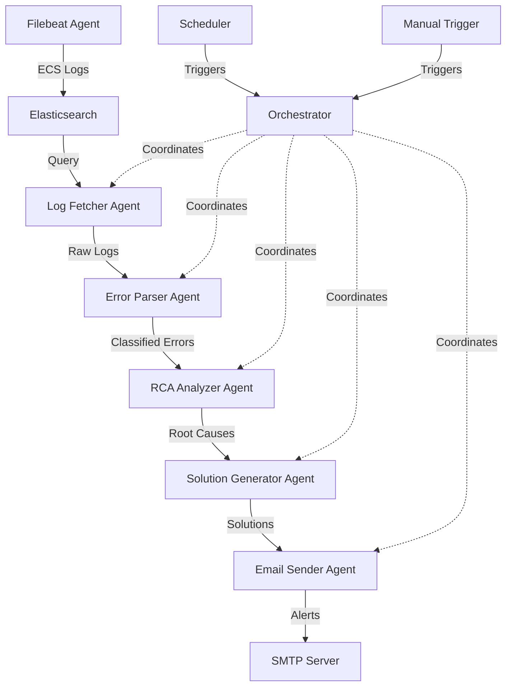

# Agentic AI Log Analysis System - Architecture

## System Overview

The Agentic AI Log Analysis System is a production-grade, autonomous platform designed to ingest, analyze, and remediate issues detected in application and infrastructure logs. The system leverages a multi-agent architecture where specialized AI agents collaborate to provide intelligent log analysis and actionable insights.

## Architecture Principles

1. **Modularity**: Each agent is independent with clear responsibilities
2. **Autonomy**: Minimal human intervention required for daily operations
3. **Resilience**: Comprehensive error handling and retry mechanisms
4. **Scalability**: Designed to handle high log volumes
5. **Observability**: Structured logging for monitoring and debugging
6. **Security**: Credentials managed via environment variables

## High-Level Architecture



## Data Flow

### 1. Log Ingestion
- **Source**: Application/Infrastructure logs
- **Agent**: Filebeat
- **Format**: Elastic Common Schema (ECS)
- **Destination**: Elasticsearch indices

### 2. Log Retrieval
- **Agent**: Log Fetcher Agent
- **Input**: Time range, filters, severity levels
- **Process**: 
  - Query Elasticsearch with pagination
  - Filter by service, environment, log level
  - Handle connection failures and retries
- **Output**: Normalized log objects

### 3. Error Classification
- **Agent**: Error Parser Agent
- **Input**: Raw log entries
- **Process**:
  - Classify by type (application, infrastructure, security, performance)
  - Detect patterns and anomalies
  - Group related errors
  - Extract key metadata (timestamps, services, error codes)
- **Output**: Structured error objects with classifications

### 4. Root Cause Analysis
- **Agent**: RCA Analyzer Agent
- **Input**: Classified errors
- **Process**:
  - Perform causal reasoning
  - Correlate across services and timestamps
  - Identify probable root causes
  - Rank by confidence
- **Output**: RCA report with confidence scores

### 5. Solution Generation
- **Agent**: Solution Generator Agent
- **Input**: RCA report
- **Process**:
  - Use AI reasoning (OpenAI GPT-4)
  - Generate step-by-step remediation
  - Include preventive measures
  - Provide confidence assessment
- **Output**: Actionable solution with steps

### 6. Alert Distribution
- **Agent**: Email Sender Agent
- **Input**: Complete analysis (errors + RCA + solutions)
- **Process**:
  - Format structured email
  - Include all relevant details
  - Retry on SMTP failures
- **Output**: Email alerts to stakeholders

## Component Details

### Log Fetcher Agent

**Responsibilities**:
- Connect to Elasticsearch cluster
- Execute time-based queries
- Handle pagination for large result sets
- Normalize ECS format to internal format
- Implement retry logic for transient failures

**Key Methods**:
- `connect()`: Establish Elasticsearch connection
- `fetch_logs(start_time, end_time, filters)`: Retrieve logs
- `normalize_log(raw_log)`: Convert ECS to internal format

**Error Handling**:
- Connection timeouts
- Authentication failures
- Query syntax errors
- Index not found

### Error Parser Agent

**Responsibilities**:
- Classify log entries by error type
- Detect anomalies and patterns
- Group related errors
- Extract structured metadata

**Classification Categories**:
- **Application Errors**: Exceptions, stack traces, application-level failures
- **Infrastructure Errors**: Network issues, resource exhaustion, service unavailability
- **Security Errors**: Authentication failures, authorization violations, suspicious activity
- **Performance Errors**: Slow queries, timeouts, resource contention

**Key Methods**:
- `classify_log(log_entry)`: Determine error category
- `detect_patterns(log_batch)`: Identify recurring issues
- `group_errors(classified_logs)`: Cluster related errors

### RCA Analyzer Agent

**Responsibilities**:
- Perform causal analysis
- Correlate events across services
- Identify temporal relationships
- Rank root causes by probability

**Analysis Techniques**:
- Temporal correlation
- Service dependency mapping
- Error propagation tracking
- Statistical anomaly detection

**Key Methods**:
- `analyze(error_groups)`: Perform RCA
- `correlate_events(events)`: Find relationships
- `rank_causes(candidates)`: Prioritize by confidence

### Solution Generator Agent

**Responsibilities**:
- Generate remediation steps using AI
- Provide preventive recommendations
- Include confidence scoring
- Tailor solutions to error type

**AI Integration**:
- Model: OpenAI GPT-4 (configurable)
- Prompt engineering for structured output
- Context: Error details, RCA, historical patterns
- Output: Step-by-step solutions with rationale

**Key Methods**:
- `generate_solution(rca_report)`: Create remediation plan
- `format_solution(raw_solution)`: Structure output
- `assess_confidence(solution)`: Calculate confidence score

### Email Sender Agent

**Responsibilities**:
- Format comprehensive email reports
- Send via SMTP with TLS
- Implement retry logic
- Track delivery status

**Email Structure**:
- Subject: Error summary with severity
- Body:
  - Executive summary
  - Error details (timestamps, services, counts)
  - Root cause analysis
  - Recommended solutions
  - Confidence scores
  - Next steps

**Key Methods**:
- `format_email(analysis_result)`: Create email content
- `send_email(recipients, content)`: Deliver via SMTP
- `retry_send(email_data)`: Handle failures

### Orchestrator

**Responsibilities**:
- Coordinate agent execution
- Manage execution flow
- Handle inter-agent communication
- Implement scheduling
- Provide manual trigger interface

**Execution Modes**:
- **Scheduled**: Daily automated runs (configurable time)
- **Manual**: On-demand analysis with custom parameters

**Key Methods**:
- `run_analysis(mode, params)`: Execute full pipeline
- `schedule_daily()`: Set up recurring runs
- `handle_failure(agent, error)`: Graceful degradation

**Workflow**:
1. Initialize all agents
2. Fetch logs (Log Fetcher Agent)
3. Parse and classify (Error Parser Agent)
4. Perform RCA (RCA Analyzer Agent)
5. Generate solutions (Solution Generator Agent)
6. Send alerts (Email Sender Agent)
7. Log execution results
8. Update progress tracking

## Configuration Management

### Elasticsearch Configuration (`config/elasticsearch.yaml`)
```yaml
host: ${ES_HOST}
port: ${ES_PORT}
username: ${ES_USERNAME}
password: ${ES_PASSWORD}
index_pattern: ${ES_INDEX_PATTERN}
timeout: 30
max_retries: 3
```

### AI Configuration (`config/ai.yaml`)
```yaml
provider: openai
api_key: ${OPENAI_API_KEY}
model: ${OPENAI_MODEL}
temperature: 0.3
max_tokens: 2000
```

### SMTP Configuration (`config/smtp.yaml`)
```yaml
host: ${SMTP_HOST}
port: ${SMTP_PORT}
username: ${SMTP_USERNAME}
password: ${SMTP_PASSWORD}
use_tls: true
recipients: ${ALERT_RECIPIENTS}
```

## Error Handling Strategy

### Retry Logic
- **Transient Failures**: Exponential backoff (max 3 retries)
- **Permanent Failures**: Log and alert, continue with degraded functionality

### Graceful Degradation
- If RCA fails: Send alerts with classification only
- If solution generation fails: Send alerts with RCA only
- If email fails: Log locally and retry later

### Logging
- All errors logged with full context
- Structured JSON format for parsing
- Severity levels: DEBUG, INFO, WARNING, ERROR, CRITICAL

## Security Considerations

1. **Credential Management**: All secrets via environment variables
2. **Network Security**: TLS for SMTP, HTTPS for Elasticsearch
3. **API Key Rotation**: Support for dynamic key updates
4. **Access Control**: Principle of least privilege
5. **Audit Logging**: All actions logged with timestamps

## Scalability

### Current Design
- Handles up to 100K logs per analysis run
- Pagination prevents memory overflow
- Asynchronous processing where applicable

### Future Enhancements
- Distributed processing for larger volumes
- Caching for repeated queries
- Batch processing optimization

## Monitoring and Observability

### Metrics Tracked
- Logs processed per run
- Agent execution times
- Error rates by agent
- Email delivery success rate
- AI API latency

### Logging
- Structured JSON logs
- Correlation IDs for tracing
- Agent-level logging
- Execution summaries

## Deployment

### Requirements
- Python 3.11+ runtime
- Network access to Elasticsearch
- Network access to SMTP server
- OpenAI API access
- Sufficient memory for log processing (2GB+ recommended)

### Deployment Options
- **Standalone**: Single server with cron/scheduler
- **Containerized**: Docker with volume mounts for config
- **Orchestrated**: Kubernetes CronJob for scheduled runs

## Maintenance

### Regular Tasks
- Monitor execution logs
- Review email delivery rates
- Update AI prompts based on feedback
- Rotate API keys
- Update dependencies

### Troubleshooting
- Check Elasticsearch connectivity
- Verify SMTP credentials
- Review agent logs for errors
- Validate configuration files
- Test AI API access

## Future Roadmap

1. **Enhanced AI Capabilities**
   - Multi-model support (Claude, Gemini)
   - Fine-tuned models for domain-specific analysis
   - Automated learning from feedback

2. **Advanced Analytics**
   - Trend analysis over time
   - Predictive failure detection
   - Automated remediation execution

3. **Integration Expansion**
   - Slack/Teams notifications
   - Ticketing system integration (Jira, ServiceNow)
   - Metrics dashboards (Grafana)

4. **Performance Optimization**
   - Parallel agent execution
   - Caching layer
   - Incremental processing

## Conclusion

This architecture provides a robust, scalable, and maintainable foundation for autonomous log analysis. The modular design allows for independent evolution of components while maintaining system integrity.
