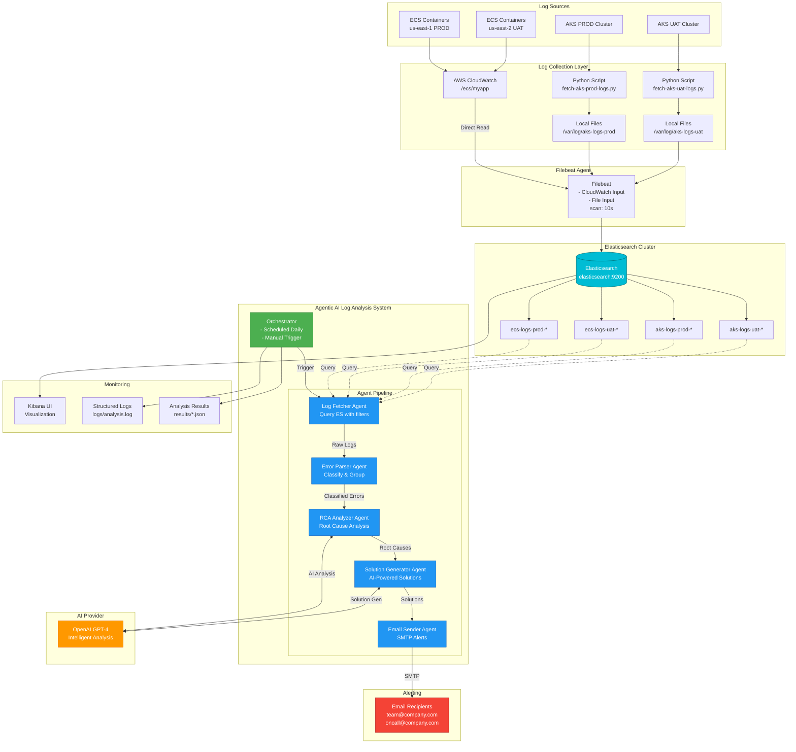
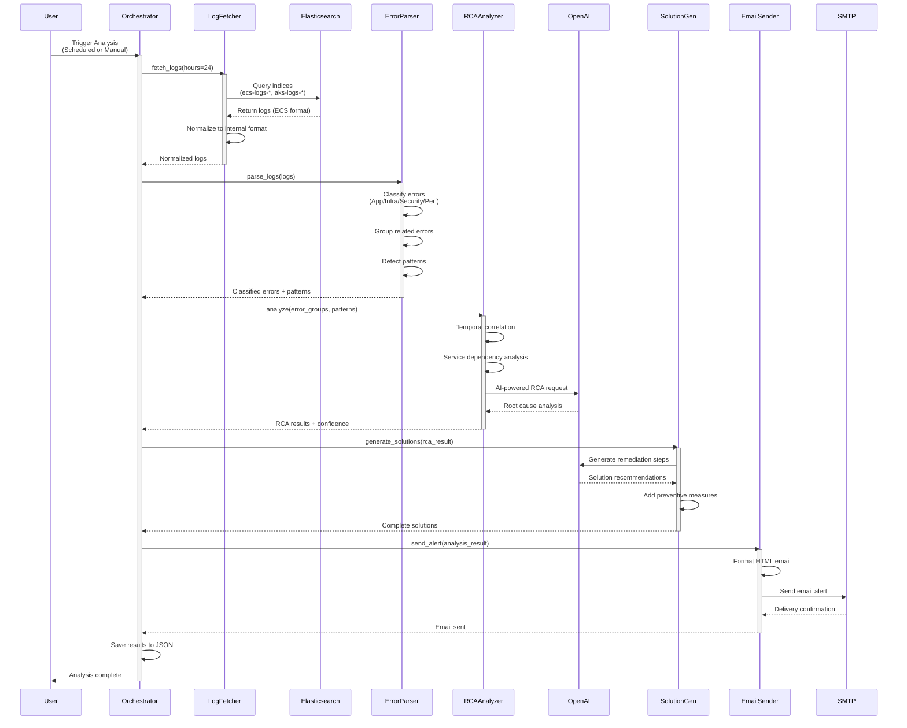
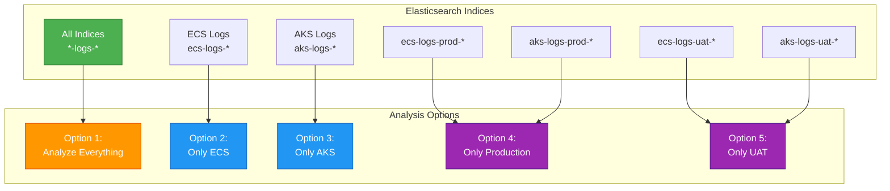
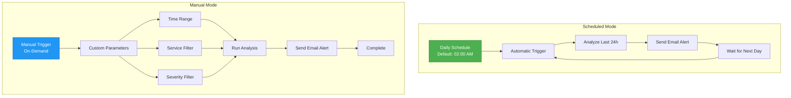
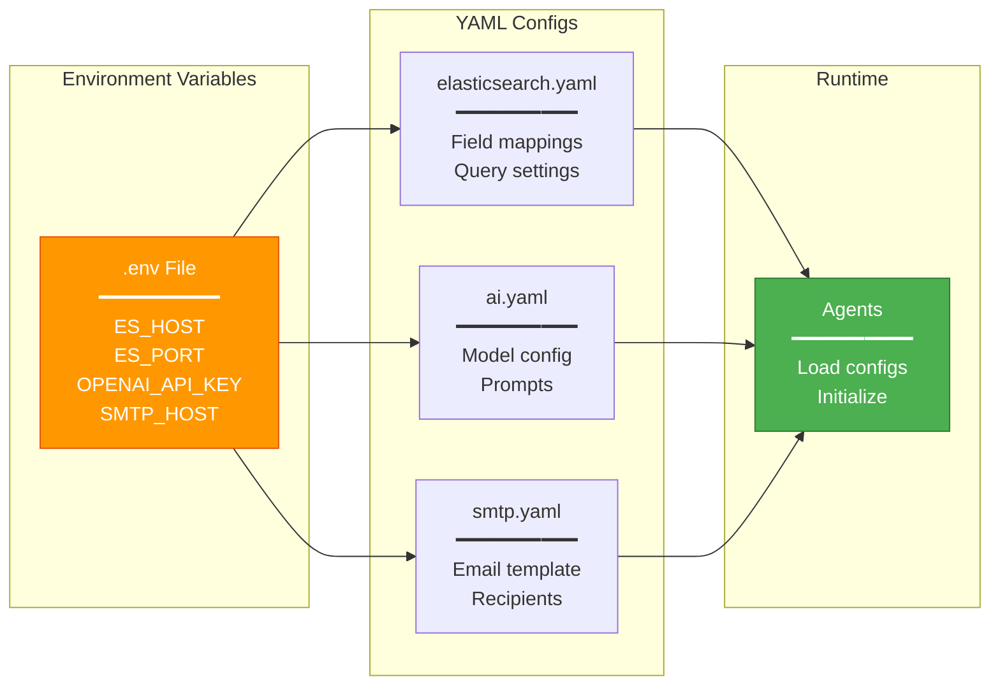
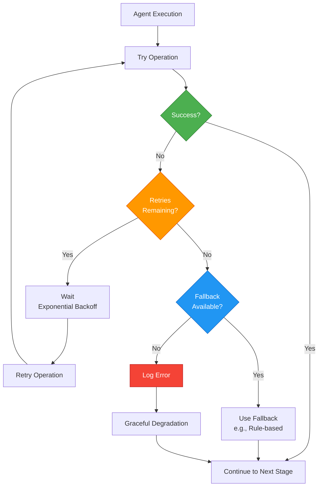

# Complete System Flow Diagram - Agentic AI Log Analysis Integration

## End-to-End Log Analysis Flow

---

## Detailed Agent Execution Flow

---

## Data Flow Through Agents

```mermaid
graph LR
    subgraph "Input"
        RAW[Raw Logs from ES<br/>- ECS format<br/>- Multiple indices<br/>- Time filtered]
    end

    subgraph "Stage 1: Fetch"
        FETCH[Log Fetcher<br/>━━━━━━━━━━<br/>• Query ES<br/>• Pagination<br/>• Normalize]
        NORM[Normalized Logs<br/>━━━━━━━━━━<br/>timestamp, message,<br/>service, error_type]
    end

    subgraph "Stage 2: Parse"
        PARSE[Error Parser<br/>━━━━━━━━━━<br/>• Classify<br/>• Group<br/>• Detect patterns]
        CLASS[Classified Data<br/>━━━━━━━━━━<br/>error_groups,<br/>patterns,<br/>statistics]
    end

    subgraph "Stage 3: Analyze"
        ANALYZE[RCA Analyzer<br/>━━━━━━━━━━<br/>• Correlate<br/>• AI analysis<br/>• Rank causes]
        CAUSES[Root Causes<br/>━━━━━━━━━━<br/>causes,<br/>confidence,<br/>evidence]
    end

    subgraph "Stage 4: Solve"
        SOLVE[Solution Generator<br/>━━━━━━━━━━<br/>• AI solutions<br/>• Rule-based<br/>• Risk assess]
        SOL[Solutions<br/>━━━━━━━━━━<br/>actions,<br/>preventive,<br/>verification]
    end

    subgraph "Stage 5: Alert"
        ALERT[Email Sender<br/>━━━━━━━━━━<br/>• Format HTML<br/>• SMTP send<br/>• Retry logic]
        SENT[Email Alert<br/>━━━━━━━━━━<br/>Errors + RCA<br/>+ Solutions]
    end

    RAW --> FETCH
    FETCH --> NORM
    NORM --> PARSE
    PARSE --> CLASS
    CLASS --> ANALYZE
    ANALYZE --> CAUSES
    CAUSES --> SOLVE
    SOLVE --> SOL
    SOL --> ALERT
    ALERT --> SENT

    style FETCH fill:#2196F3,stroke:#1565C0,color:#fff
    style PARSE fill:#2196F3,stroke:#1565C0,color:#fff
    style ANALYZE fill:#2196F3,stroke:#1565C0,color:#fff
    style SOLVE fill:#2196F3,stroke:#1565C0,color:#fff
    style ALERT fill:#2196F3,stroke:#1565C0,color:#fff
```

---

## Index Pattern Filtering

---

## Execution Modes

---

## Configuration Flow

---

## Error Handling & Retry Flow

---

## Summary

This system provides:

1. **Unified Analysis** across ECS and AKS logs
2. **Flexible Filtering** by environment, service, time
3. **AI-Powered Intelligence** with rule-based fallback
4. **Automated Alerting** via email
5. **Production-Ready** error handling and retry logic
6. **Comprehensive Logging** for observability
